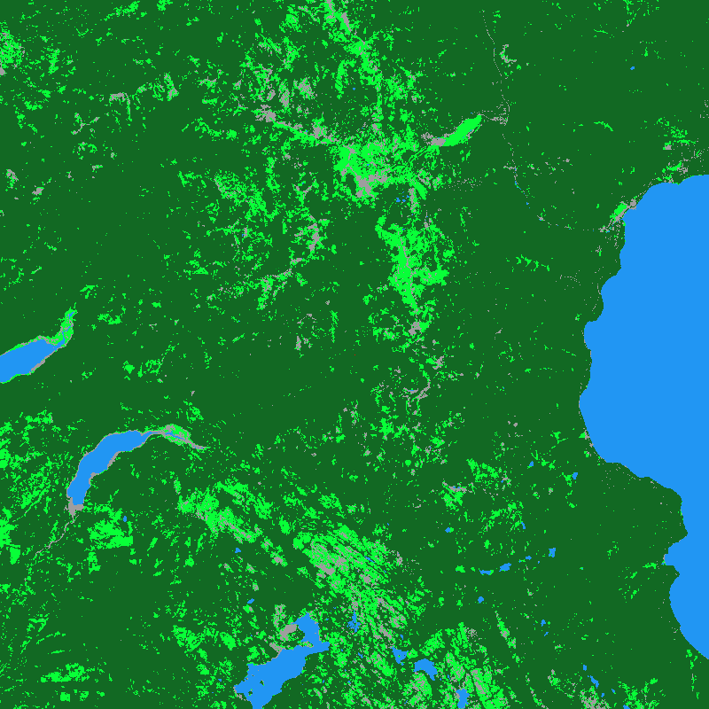

# Mini Fire Model + Agents

A simple, customizable wildfire cellular automaton plus optional **agent** layer (crews, trucks, aircraft, drones).  
Each grid cell is one of: `0=EMPTY, 1=FUEL, 2=BURNING, 3=BURNED`.  
Optionally, fuel is typed (Grass=1, Shrub=2, Timber=3, Water=4) with different ignition/burn behavior.  
Terrain, wind, and finite fuel can bias spread.



---

## Repository layout

- `mini_fire_model.py` – core wildfire CA (map fetch, ignition, spread, GIF export).
- `agents.py` – agent taxonomy and rules + the engine that moves agents and applies suppression (returns per-tick p0 multipliers and a persistent retardant map).
- `run_with_agents.py` – runner that imports the core model, spawns agents (e.g., crews) around the initial spark, steps both systems, draws agents, and writes a GIF.

---

## Quick start

```bash
# 1) Install
pip install numpy matplotlib pillow rasterio terracatalogueclient shapely requests python-dotenv imageio

# 2) (Optional) Put OPENTOPO_API_KEY in your environment or a .env file
#    Needed only if AUTO_FETCH_DATA is True.

# 3a) Run the base model
python mini_fire_model.py

# 3b) Run the model + agents
python run_with_agents.py
